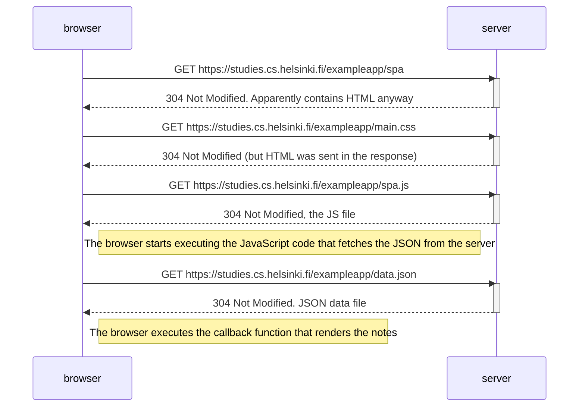

```mermaid
sequenceDiagram
    participant browser
    participant server

    browser->>server: GET https://studies.cs.helsinki.fi/exampleapp/spa
    activate server
    server-->>browser: 304 Not Modified.  Apparently contains HTML anyway
    deactivate server

    browser->>server: GET https://studies.cs.helsinki.fi/exampleapp/main.css
    activate server
    server-->>browser: 304 Not Modified (but HTML was sent in the response)
    deactivate server

    browser->>server: GET https://studies.cs.helsinki.fi/exampleapp/spa.js
    activate server
    server-->>browser: 304 Not Modified, the JS file
    deactivate server
    Note right of browser: The browser starts executing the JavaScript code that fetches the JSON from the server


    browser->>server: GET https://studies.cs.helsinki.fi/exampleapp/data.json
    activate server
    server-->>browser: 304 Not Modified.  JSON data file
    deactivate server


    Note right of browser: The browser executes the callback function that renders the notes
```
