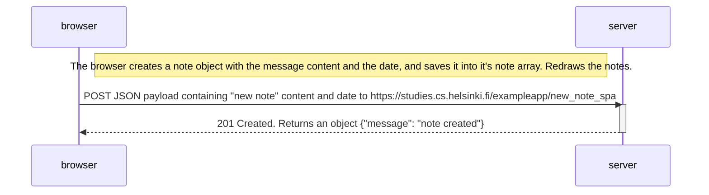

```mermaid
sequenceDiagram
    participant browser
    participant server

    Note right of browser: The browser creates a note object with the message content and the date, and saves it into it's note array.  Redraws the notes.  
    browser->>server: POST JSON payload containing "new note" content and date to https://studies.cs.helsinki.fi/exampleapp/new_note_spa
    activate server
    server-->>browser: 201 Created.  Returns an object {"message": "note created"}
    deactivate server
```
